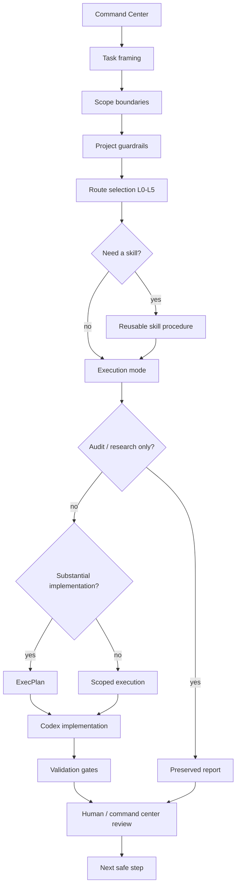
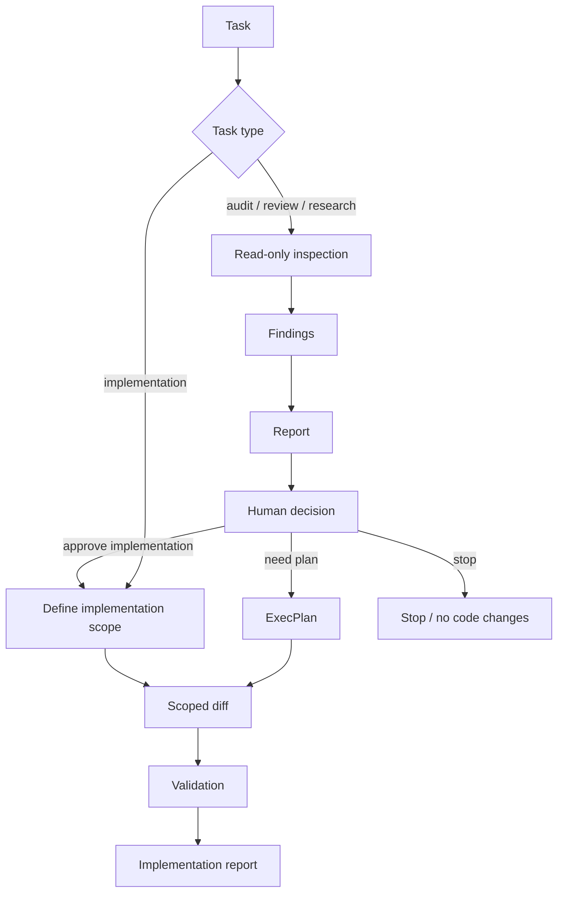
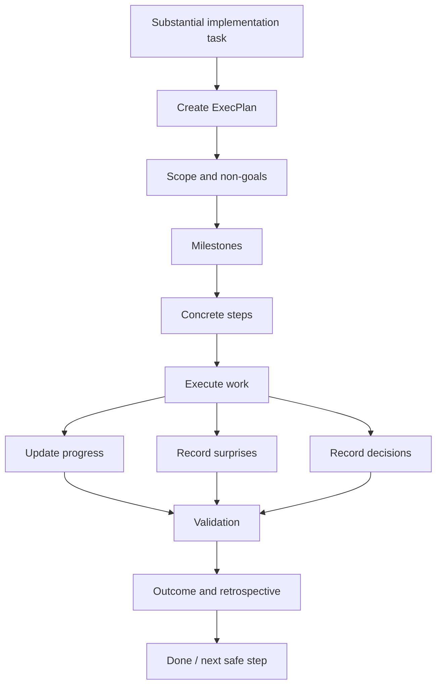

# Codex Ops Workflow Demo

Визуально-ориентированная демонстрация контролируемой операционной модели для AI-assisted разработки с Codex.

Этот репозиторий показывает, как выстраивать работу Codex как ограниченный по scope, route-driven и проверяемый инженерный workflow, а не как набор ad-hoc prompts.

> Codex не должен получать неограниченный context и неограниченные полномочия.  
> Он должен получать правильную задачу, правильный scope, правильный route и правильную границу validation.

---

## Что это

`codex-ops-workflow-demo` — публичная, очищенная architecture demo, основанная на приватном локальном Codex workflow.

Она показывает, как координировать:

- task framing;
- scope boundaries;
- project-level guardrails;
- route hints;
- reusable skills;
- read-only audits;
- reports;
- ExecPlans;
- validation gates;
- stop conditions.

Цель — сделать AI-assisted development более контролируемой, проверяемой и восстановимой.

---

## Чем это не является

Это не:

- autonomous coding-agent framework;
- коллекция prompts;
- выгрузка приватных правил `AGENTS.md`;
- замена code review;
- production security model;
- полностью автоматизированная система software development.

Это workflow architecture для более безопасного и осознанного использования Codex внутри реального проекта.

---

## Проблема

AI coding tools мощны, но без operating model они легко могут:

- выйти за пределы запрошенного scope;
- читать слишком много нерелевантного context;
- смешивать audit и implementation;
- начинать писать код до понимания проблемы;
- терять решения в истории чата;
- выполнять широкие refactors без достаточного review;
- усложнять возобновление долгих задач;
- размывать границу между recommendation и approval.

Эта demo решает эти риски через разделение task strategy, execution routes, audits, reports, plans, implementation и validation.

---

## Основная идея

Система организована как layered workflow:

```text
Command Center
→ Task normalization
→ Project guardrails
→ Route selection
→ Skill / route procedure
→ Optional read-only audit
→ Report or ExecPlan
→ Scoped Codex execution
→ Validation
→ Result review / next safe step
```

Центральный принцип:

```text
Give Codex enough context to execute the task,
but not enough freedom to own the whole project.
```

---

## Операционная модель



Mermaid source: `diagrams/codex-operating-model.mmd`

---

## Основные компоненты

### 1. Command Center

Command Center — это слой human + assistant, который формулирует задачу до того, как Codex начнёт её выполнять.

Он отвечает за:

- уточнение цели;
- определение scope и non-goals;
- выбор или рекомендацию route hint;
- решение, что требуется: audit, report, ExecPlan, implementation или review;
- определение approval boundaries;
- review возвращённого результата.

Codex выполняет работу локально внутри утверждённого scope. По умолчанию он не владеет product- или architecture decisions.

---

### 2. Project guardrails

Слой project guardrails задаёт стабильные правила, которые Codex не должен забывать.

В приватном проекте он может быть представлен файлами вроде `AGENTS.md`.

Концептуально этот слой хранит:

- non-negotiable architecture rules;
- действия, запрещённые без approval;
- validation expectations;
- source-of-truth boundaries;
- доступные локальные procedures;
- project-specific risk boundaries.

Хороший guardrails-файл не должен превращаться в гигантский manual. Он должен хранить invariants, а подробные procedures должны жить в отдельных skills или route documents.

---

### 3. Route hints

Route hints выбирают рекомендуемый execution mode.

Это не жёсткая “difficulty score”. Они помогают сопоставить задачу с безопасной формой workflow.

| Route | Typical use |
|---|---|
| `L0 Direct` | Небольшое локальное исправление или тривиальная правка docs. |
| `L1 Micro-plan` | Короткая задача с несколькими ясными steps. |
| `L2 Plan iterations` | Multi-step implementation с checkpoints. |
| `L3 Independent checks` | Audit/review/research с дополнительной verification. |
| `L4 Route exploration` | Сравнение architecture routes до выбора path. |
| `L5 Deep branching` | Дорогая exploration, prototypes или high-uncertainty design work. |

Codex может выбрать более лёгкий или тяжёлый route, если inspection репозитория показывает, что так безопаснее, но значимое отклонение должно быть объяснено.

---

### 4. Skills

Skills — это reusable task procedures.

Они предотвращают повторение prompt boilerplate и помогают держать project guardrails компактными.

Примеры категорий skills:

- audit-only investigation;
- diff review;
- docs update;
- reasoning route selection;
- report writing;
- subagent routing.

Skill должен быть узким и процедурным. Он не должен заменять project guardrails, approved scope или human decision-making.

---

### 5. Read-only audit agents

Read-only subagents могут использоваться для сфокусированных независимых проверок перед рискованными решениями.

Примеры:

- architecture boundary audit;
- test coverage audit;
- documentation staleness audit;
- diff review;
- risk review before deletion/refactor.

Важная граница:

```text
Audit finds issues.
Audit does not automatically implement fixes.
```

Implementation требует explicit approval, scoped task или ExecPlan, если работа substantial.

---

### 6. Reports

Reports сохраняют analysis.

Они полезны для:

- audit findings;
- route comparisons;
- research conclusions;
- review summaries;
- risk analysis.

Report по умолчанию не является source of truth.

Durable conclusions должны переноситься в правильную project documentation только после explicit approval.

---

### 7. ExecPlans

ExecPlans — это living implementation specifications для substantial work.

ExecPlan стоит использовать, когда задача:

- multi-step;
- multi-file;
- architecture-sensitive;
- long-running;
- staged;
- вероятно потребует recovery или continuation другим agent/developer.

Хороший ExecPlan должен быть:

- self-contained;
- beginner-friendly;
- outcome-focused;
- explicitly verifiable;
- recoverable;
- updated as work proceeds.

Он должен отслеживать:

- progress;
- surprises and discoveries;
- decision log;
- concrete steps;
- validation;
- idempotence and recovery;
- outcomes and retrospective.

---

## Audit vs implementation



Mermaid source: `diagrams/audit-vs-implementation.mmd`

Такое разделение предотвращает частый failure mode: audit обнаруживает проблему, и AI tool сразу начинает менять код без approval.

---

## Жизненный цикл ExecPlan



Mermaid source: `diagrams/execplan-lifecycle.mmd`

---

## Почему это полезно

Эта operating model улучшает AI-assisted development, делая работу:

- scoped;
- auditable;
- resumable;
- менее зашумлённой context;
- безопаснее для architecture-sensitive changes;
- проще для review;
- проще для validation;
- менее зависимой от chat memory.

Она также даёт чёткое различие между:

```text
task framing
audit
planning
implementation
validation
decision-making
```

---

## Пример workflow

Типичная substantial task может выглядеть так:

```text
1. Command Center defines goal, scope, non-goals, and route hint.
2. Codex reads project guardrails and task-relevant files.
3. Route selection chooses L2 or L3.
4. If risk is high, Codex performs read-only audit first.
5. Audit produces a report, not a code change.
6. Human approves implementation.
7. Codex creates or follows an ExecPlan.
8. Work proceeds through scoped milestones.
9. Validation commands are run.
10. Codex reports changes, risks, and next safe step.
```

---

## Структура репозитория

Рекомендуемая структура public demo:

```text
codex-ops-workflow-demo/
│
├── README.md
│
├── docs/
│   ├── OPERATING_MODEL.md
│   ├── ROUTE_LEVELS.md
│   ├── AUDIT_AND_IMPLEMENTATION.md
│   ├── EXECPLAN_LIFECYCLE.md
│   └── DISCLOSURE_BOUNDARIES.md
│
└── diagrams/
    ├── codex-operating-model.mmd
    ├── task-routing-flow.mmd
    ├── route-levels.mmd
    ├── audit-vs-implementation.mmd
    └── execplan-lifecycle.mmd
```

---

## Что намеренно опущено

Эта public demo не включает:

- private project source code;
- private product details;
- реальные implementation diffs;
- полные приватные правила `AGENTS.md`;
- private audit reports;
- private task history;
- secrets or credentials;
- business-sensitive context.

Цель — показать operating model, а не раскрывать private project.

---

## Темы для обсуждения

Эта demo предназначена для технического обсуждения вокруг:

- AI-assisted development workflows;
- Codex task routing;
- context management;
- project guardrails;
- audit vs implementation boundaries;
- long-running task recovery;
- route selection;
- validation gates;
- human-in-the-loop approval.

---

## Summary

`codex-ops-workflow-demo` демонстрирует controlled operating model для Codex-based development.

Ключевая идея:

```text
Do not treat Codex as an unrestricted autonomous developer.
Treat it as a scoped engineering executor inside a route-driven workflow.
```
