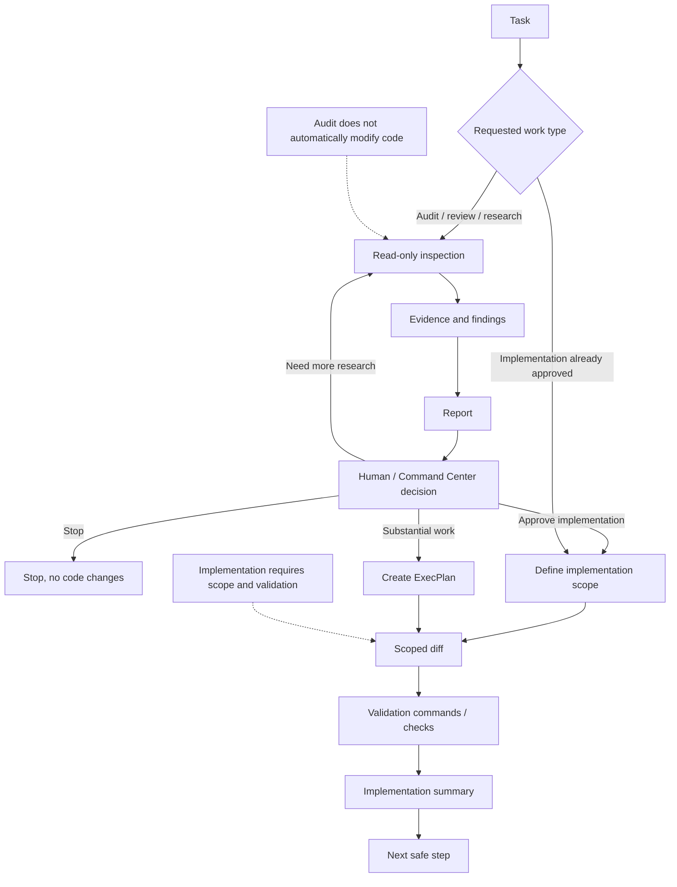

# Аудит и реализация

Этот документ описывает разделение между аудитом, исследованием, ревью, планированием и реализацией в `codex-ops-workflow-demo`.

Цель этой границы — сохранять работу Codex ограниченной по scope, пригодной для ревью и безопасной. Найденная проблема не является автоматическим разрешением менять код. Рекомендация не является автоматически утверждённым планом реализации.

---

## 1. Ключевой принцип

Ключевой принцип:

```text
Audit investigates.
Implementation changes.
Approval connects them.
```

Иными словами:

```text
Аудит исследует.
Реализация изменяет.
Утверждение связывает их.
```

Контролируемый workflow с Codex не должен позволять read-only исследованию незаметно превращаться в широкую задачу на реализацию.

---

## 2. Почему эта граница важна

AI coding tools часто размывают границу между:

```text
finding a problem
recommending a fix
implementing the fix
changing architecture
```

То есть между:

```text
поиском проблемы
рекомендацией исправления
реализацией исправления
изменением архитектуры
```

Это может создавать несколько рисков:

- широкие diffs за пределами исходной задачи;
- архитектурные изменения без утверждения;
- несвязанные исправления, смешанные в одном изменении;
- скрытые предположения, превращённые в реализацию;
- тесты, изменённые под плохую реализацию;
- audit findings, ошибочно воспринятые как source of truth;
- потеря человеческого контроля над решениями.

Разделение аудита и реализации делает workflow безопаснее.

---

## 3. Поток audit vs implementation



Mermaid source: `diagrams/audit-vs-implementation.mmd`.

---

## 4. Режим аудита

Audit mode — read-only режим.

Он используется, когда задача состоит в том, чтобы проверить, верифицировать, сравнить или оценить риск.

Примеры:

- аудит архитектурных границ;
- аудит покрытия тестами;
- проверка согласованности документации;
- diff review;
- ревью рисков security/privacy;
- сравнение маршрутов;
- оценка зависимости;
- анализ риска удаления/refactor.

Ожидаемый результат:

```text
findings
evidence
severity
risk
recommendation
next safe step
```

Ожидаемое поведение:

```text
read relevant files
do not modify code
do not start implementation
return findings
```

---

## 5. Режим реализации

Implementation mode используется, когда задача утверждена как изменение.

Он требует:

- ясного scope;
- non-goals;
- утверждённых файлов или областей;
- acceptance criteria;
- validation expectations;
- stop conditions.

Реализация может быть прямой для малых задач или плановой для существенной работы.

Ожидаемый результат:

```text
what changed
why it changed
validation performed
risks / limitations
next safe step
```

---

## 6. Граница report

Reports сохраняют анализ. Они не становятся автоматически project policy.

Report может включать:

- findings;
- evidence;
- route comparison;
- risk analysis;
- recommendation.

Но устойчивые выводы должны переноситься в соответствующую проектную документацию только после явного утверждения.

Это предотвращает превращение report в скрытый source of truth.

---

## 7. Граница утверждения

Утверждение требуется при переходе от исследования к реализации, особенно если изменение затрагивает:

- архитектурное направление;
- публичное поведение;
- workflow transitions;
- prompts/schemas/models;
- security/privacy/payment logic;
- dependencies;
- storage или database structure;
- широкие refactors;
- удаление кода или документации;
- generated artifacts;
- validation policy.

Безопасный шаблон:

```text
Audit result
→ command center review
→ explicit implementation scope
→ implementation or ExecPlan
```

---

## 8. Когда использовать ExecPlan

Используй ExecPlan, когда реализация существенная.

Типовые триггеры:

- multi-step implementation;
- multi-file implementation;
- architecture-sensitive change;
- long-running task;
- staged implementation;
- risky migration;
- need for recovery or handoff.

ExecPlan делает реализацию самодостаточной, возобновляемой и проверяемой.

---

## 9. Diff review

Diff review — особая форма аудита.

Он должен проверять:

- соответствует ли diff утверждённому scope;
- появились ли несвязанные изменения;
- соблюдены ли архитектурные границы;
- были ли тесты/документация обновлены надлежащим образом;
- была ли validation достаточной;
- появились ли новые риски.

Diff review должен оставаться read-only, если только явно не попросили что-то исправить.

---

## 10. Частые failure modes

### Failure mode 1: аудит начинает исправлять

```text
Task: "Check if this architecture is safe."
Bad behavior: Codex changes architecture while checking.
```

Корректное поведение:

```text
inspect
report findings
ask for approval before implementation
```

### Failure mode 2: report становится скрытой policy

```text
Task: "Write a report."
Bad behavior: future tasks treat the report as source of truth.
```

Корректное поведение:

```text
report is preserved analysis
durable conclusions require approved docs update
```

### Failure mode 3: реализация расширяет scope

```text
Task: "Fix one validation bug."
Bad behavior: Codex refactors the whole validation layer.
```

Корректное поведение:

```text
make scoped fix
note possible broader refactor as future work
```

### Failure mode 4: тесты меняются под реализацию

```text
Bad behavior: failing tests are weakened without approval.
```

Корректное поведение:

```text
investigate failures
fix implementation if tests are valid
ask for approval if test expectations should change
```

---

## 11. Stop conditions

Codex должен остановиться и запросить уточнение или утверждение, когда:

- запрошенная задача конфликтует с project guardrails;
- реализация требует изменения архитектурного направления;
- исправление выходит за утверждённый scope;
- аудит выявляет более крупную проблему;
- тесты падают по несвязанным причинам;
- появляется необходимость в новой зависимости;
- требуется изменение prompts/schemas/model policy;
- затрагивается security/privacy/payment behavior;
- source of truth неоднозначен;
- задача становится существенно больше, чем ожидалось.

Остановка — не провал. Это механизм безопасности.

---

## 12. Рекомендуемая структура report

Лёгкий audit report может включать:

```text
Title
Scope
Files inspected
Findings
Severity
Evidence
Risks
Recommendations
What was not inspected
Next safe step
```

Report должен отделять факты от рекомендаций.

---

## 13. Рекомендуемая структура implementation summary

Хорошее implementation summary должно включать:

```text
Goal
Scope
Files changed
Behavior changed
Validation run
Validation skipped and why
Risks
Follow-up recommendations
```

Это делает результат пригодным для ревью.

---

## 14. Summary

Audit и implementation — разные workflows.

Безопасный шаблон:

```text
inspect first when risk is high
report findings
get approval
define scope
implement narrowly
validate
summarize
```

Ключевое правило:

```text
Do not let analysis silently become implementation.
```

Иными словами:

```text
Не позволяй анализу незаметно превращаться в реализацию.
```
