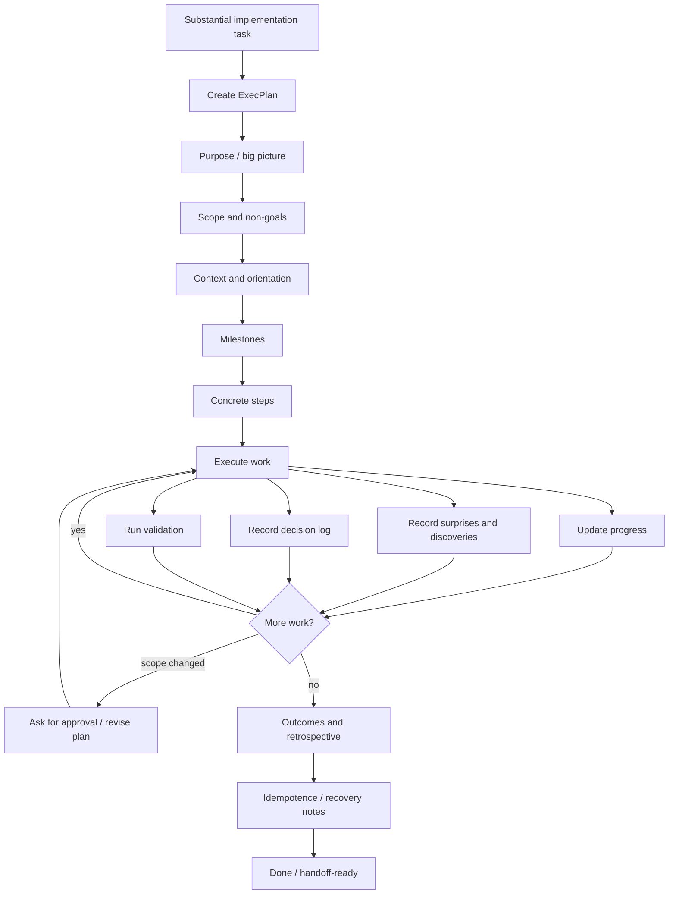

# Жизненный цикл ExecPlan

Этот документ описывает жизненный цикл ExecPlan, используемый в `codex-ops-workflow-demo`.

ExecPlan — это живая спецификация реализации для существенной работы с Codex. Он используется, когда задача слишком крупная, рискованная или многоэтапная, чтобы безопасно выполнять её как простое прямое редактирование.

---

## 1. Ключевой принцип

Ключевой принцип:

```text
Долгая реализация должна быть возобновляемой,
проверяемой и понятной без опоры на память чата.
```

ExecPlan — это не scratchpad, не отчёт и не расплывчатый TODO-список.

Это самодостаточный рабочий документ, который позволяет Codex, другому агенту или разработчику безопасно продолжить задачу.

---

## 2. Когда использовать ExecPlan

Используй ExecPlan, когда задача:

- многоэтапная;
- затрагивает несколько файлов;
- чувствительна к архитектуре;
- долго выполняется;
- должна идти по стадиям;
- рискованна для выполнения за один проход;
- вероятно потребует handoff;
- вероятно потребует восстановления после частичного выполнения.

Типичные примеры:

- реализация новой функции;
- рефакторинг подсистемы;
- добавление новой ветки workflow;
- изменение поведения persistence или storage;
- добавление новой интеграции;
- миграция архитектуры;
- реализация утверждённого маршрута после аудита.

Не используй ExecPlan для тривиальных правок, небольших изменений документации или узких локальных исправлений с очевидным путём выполнения.

---

## 3. Диаграмма жизненного цикла



Mermaid source: `diagrams/execplan-lifecycle.mmd`.

---

## 4. Что должен содержать ExecPlan

Полезный ExecPlan должен включать:

| Раздел | Назначение |
|---|---|
| Purpose | Какой наблюдаемый результат должна дать работа. |
| Scope | Что входит в задачу. |
| Non-goals | Что не должно изменяться. |
| Context | Релевантные файлы, концепции, предположения и ограничения. |
| Milestones | Основные фазы работы. |
| Concrete steps | Конкретные действия, которые нужно выполнить. |
| Validation | Команды или проверки, подтверждающие результат. |
| Progress | Текущий статус выполнения. |
| Surprises & discoveries | Новые факты, обнаруженные во время работы. |
| Decision log | Важные решения и причины, по которым они были приняты. |
| Recovery / idempotence | Как безопасно повторить, откатить или продолжить работу. |
| Outcome / retrospective | Что завершено и что осталось. |

План должен оставаться полезным даже в том случае, если исходный контекст чата потерян.

---

## 5. Purpose и наблюдаемый результат

План должен начинаться с целевого результата.

Слабо:

```text
Refactor workflow.
```

Лучше:

```text
Добавить persistent photo upload session, чтобы ожидающие photo batches переживали перезапуск процесса.
Результат должен быть наблюдаем через workflow test, который создаёт pending batch,
перезагружает его и продолжает photo quality check без потери ссылок на загруженные фото.
```

Хороший ExecPlan описывает поведение, а не только файлы.

---

## 6. Scope и non-goals

Scope защищает задачу от неконтролируемого расширения.

Пример:

```text
Scope:
- Добавить persistence для pending photo upload sessions.
- Обновить repository и workflow handler logic.
- Добавить тесты для restart recovery.

Non-goals:
- Не менять payment flow.
- Не менять final attribution schema.
- Не переделывать Telegram UI.
```

Non-goals так же важны, как и цели. Они предотвращают широкие оппортунистические переписывания.

---

## 7. Milestones

Milestones превращают крупную задачу в проверяемые стадии.

Пример:

```text
Milestone 1: изучить текущий upload collector и его использование в workflow.
Milestone 2: спроектировать persistent session model.
Milestone 3: реализовать repository и обновление state.
Milestone 4: обновить handlers.
Milestone 5: добавить tests.
Milestone 6: запустить validation и кратко зафиксировать риски.
```

У каждого milestone должна быть структура:

```text
goal → work → result → proof
```

---

## 8. Отслеживание прогресса

План должен обновляться по мере выполнения работы.

Отслеживание прогресса должно показывать:

- завершённые шаги;
- текущий шаг;
- заблокированные пункты;
- пропущенные пункты и причину пропуска;
- статус validation;
- оставшиеся риски.

Именно это делает ExecPlan живым документом, а не статичным планом.

---

## 9. Surprises and discoveries

Долгая работа часто выявляет неожиданные факты.

Примеры:

- у файла оказалась другая ответственность, чем ожидалось;
- тест зависит от старого поведения;
- документация устарела;
- запланированный путь реализации небезопасен;
- dependency или API ведёт себя иначе;
- validation падает по несвязанной причине.

Эти находки нужно фиксировать, а не оставлять скрытыми в истории чата.

---

## 10. Decision log

Важные решения должны сохраняться.

Пример:

```text
Decision:
Использовать database-backed pending upload sessions вместо Redis для MVP.

Reason:
Текущая цель deployment проста, workflow уже сохраняет job state,
а Redis добавил бы операционную сложность раньше, чем это действительно нужно.

Alternatives considered:
- process-local memory;
- Redis;
- object storage metadata.
```

Decision log помогает будущим ревьюерам понять, почему реализация пошла именно этим путём.

---

## 11. Validation

Каждый ExecPlan должен определять validation до или во время реализации.

Validation может включать:

- unit tests;
- integration tests;
- type checking;
- linting;
- smoke scripts;
- manual verification;
- проверки консистентности документации;
- screenshot или artifact review, где это уместно.

Validation по возможности должна включать команды, рабочую директорию и ожидаемый результат.

Пример:

```text
Command:
uv run pytest tests/workflow/test_photo_upload_session.py

Expected:
All tests pass.
```

Если validation пропущена, план должен объяснить почему.

---

## 12. Recovery и idempotence

Существенная реализация должна учитывать восстановление.

Вопросы, на которые нужно ответить:

- Можно ли безопасно перезапустить задачу?
- Что будет, если выполнение остановится на середине?
- Какие файлы могут быть частично изменены?
- Как другой агент сможет продолжить?
- Какой путь отката?
- Затрагиваются ли migrations или generated files?
- Нужны ли cleanup steps?

Это особенно важно для изменений workflow, persistence, storage, payments или infrastructure.

---

## 13. Связь с reports

Reports и ExecPlans — разные артефакты.

| Artifact | Purpose |
|---|---|
| Report | Сохранённый анализ, audit findings, route comparison, recommendation. |
| ExecPlan | Рабочая спецификация реализации для утверждённой существенной работы. |

Report может рекомендовать реализацию. Он не должен автоматически превращаться в реализацию.

ExecPlan может быть создан после утверждения.

---

## 14. Связь с route levels

ExecPlans чаще всего используются с:

- `L2 Plan iterations`;
- утверждённой реализацией после `L3 Independent checks`;
- утверждённой реализацией после `L4 Route exploration`;
- `L5 Deep branching`, если prototypes или branches достаточно существенные.

Обычно они не нужны для `L0 Direct` и большинства задач `L1 Micro-plan`.

---

## 15. Типичные failure modes

### Failure mode 1: план слишком расплывчатый

Плохо:

```text
Improve architecture.
```

Хорошо:

```text
Ввести workflow transition validation layer, который отклоняет handler outcomes,
если их next_step не разрешён transition table.
```

### Failure mode 2: план не обновляется

План, который не обновляют по ходу работы, становится устаревшим и вводящим в заблуждение.

### Failure mode 3: discoveries не фиксируются

Если неожиданные находки остаются только в чате, следующий агент или разработчик теряет важный контекст.

### Failure mode 4: validation не определена

Без validation неясно, дала ли задача реально наблюдаемое поведение.

### Failure mode 5: scope расширяется молча

План должен фиксировать, когда работа требует approval, потому что больше не соответствует исходному scope.

---

## 16. Минимальный skeleton ExecPlan

Компактный skeleton:

```markdown
# ExecPlan: <title>

## Purpose
Какой наблюдаемый результат должна дать эта работа.

## Scope
Что входит в задачу.

## Non-goals
Что явно исключено.

## Context
Релевантные файлы, концепции, предположения и ограничения.

## Milestones
- [ ] Milestone 1: ...
- [ ] Milestone 2: ...

## Concrete steps
Пошаговый план реализации.

## Validation
Команды/проверки и ожидаемые результаты.

## Progress
Текущий статус.

## Surprises & discoveries
Новые находки во время работы.

## Decision log
Важные решения и обоснование.

## Recovery / idempotence
Как безопасно повторить, продолжить или откатить работу.

## Outcomes & retrospective
Что завершено, что осталось и какие выводы получены.
```

---

## 17. Summary

ExecPlan делает существенную работу с Codex:

- ограниченной по scope;
- возобновляемой;
- пригодной для review;
- проверяемой;
- восстанавливаемой;
- меньше зависящей от памяти чата.

Ключевая идея:

```text
Для маленьких задач достаточно direct execution.
Для существенных задач Codex нужна живая implementation specification.
```
