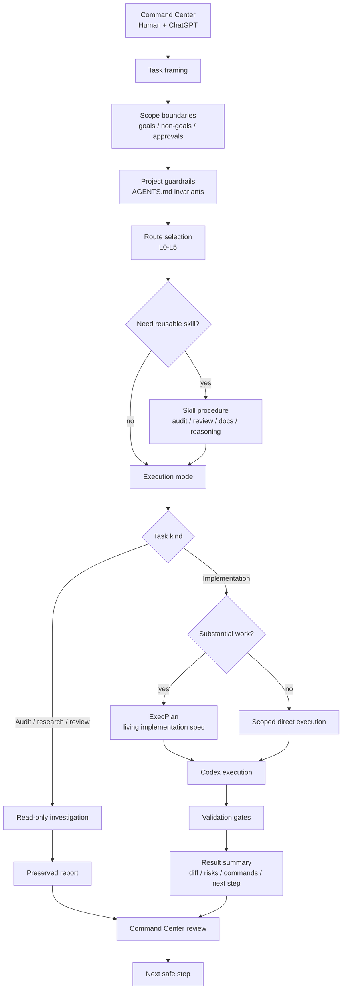

# Операционная модель

Этот документ описывает операционную модель, лежащую в основе `codex-ops-workflow-demo`.

Цель — показать, как работу с Codex можно структурировать как контролируемый, ограниченный по scope и проверяемый инженерный workflow, а не как последовательность ad-hoc prompts.

---

## 1. Ключевая идея

Операционная модель отделяет стратегию постановки задачи от локального исполнения.

```text
Command Center
→ постановка задачи
→ границы scope
→ проектные guardrails
→ выбор route
→ skill / audit / report / ExecPlan
→ ограниченное исполнение Codex
→ validation
→ review
→ следующий безопасный шаг
```

Codex рассматривается как инженерный исполнитель внутри утверждённого route и scope. Он не получает автоматического права принимать продуктовые решения, задавать архитектурное направление или выполнять широкие изменения без ограничений.

---

## 2. Зачем нужна операционная модель

AI coding tools эффективны, но у них есть предсказуемые режимы отказа:

- чтение слишком большого объёма нерелевантного контекста;
- пропуск проектных инвариантов;
- неконтролируемое расширение scope;
- смешивание audit и implementation;
- внесение широких изменений без approval;
- потеря решений в истории чата;
- сложность возобновления длинных задач;
- восприятие рекомендации как разрешения на implementation.

Операционная модель снижает эти риски, делая работу:

- ограниченной по scope;
- route-driven;
- проверяемой;
- восстанавливаемой;
- validation-aware;
- ограниченной guardrails.

---

## 3. Диаграмма операционной модели



Mermaid source: `diagrams/codex-operating-model.mmd`.

---

## 4. Command Center

Command Center — это человеческий слой принятия решений.

Он может включать:

```text
human operator
+ ChatGPT
+ project context
+ current task intent
```

Зоны ответственности:

- уточнить задачу;
- определить цель и non-goals;
- зафиксировать границы scope;
- выбрать или рекомендовать route level;
- решить, нужен ли audit, report, ExecPlan, implementation или review;
- определить approval boundaries;
- проверить результат Codex;
- выбрать следующий безопасный шаг.

Command Center не обязан самостоятельно выполнять все локальные изменения в коде. Его задача — управлять постановкой задачи и решениями.

---

## 5. Роль Codex

Codex — локальный исполнитель.

Codex должен:

- изучить репозиторий перед действиями;
- следовать project guardrails;
- оставаться внутри утверждённого task scope;
- использовать route hints и skills, когда это применимо;
- держать diff сфокусированным;
- запускать релевантную validation;
- останавливаться при достижении approval boundaries;
- отчитываться о том, что изменено, что проверено и какие риски остаются.

Codex может выбрать более безопасную локальную тактику, если inspection репозитория показывает, что исходный route слишком лёгкий или слишком тяжёлый, но существенное отклонение должно быть объяснено.

---

## 6. Project guardrails

Project guardrails хранят устойчивые правила, которые Codex не должен забывать.

Они могут включать:

- архитектурные инварианты;
- действия, запрещённые без approval;
- границы source of truth;
- ожидания по validation;
- доступные skills и agents;
- зоны риска;
- правила обновления документации;
- definition of done.

Файл guardrails не должен превращаться в полный manual. В нём стоит держать только высокоуровневые инварианты. Детальные процедуры должны жить в skills, route files, reports или ExecPlans.

Полезная ментальная модель:

```text
Guardrails хранят то, что Codex не должен забывать.
Skills хранят то, как выполнять повторяемые процедуры.
Reports хранят сохранённый анализ.
ExecPlans хранят планы длинных implementation-задач.
```

---

## 7. Выбор route

Route hints помогают выбрать режим исполнения.

Это не жёсткая оценка сложности. Это способ сопоставить задачу с нужным уровнем planning, audit, branching и approval.

Пример route levels:

| Route | Назначение |
|---|---|
| `L0 Direct` | Небольшая локальная обратимая задача. |
| `L1 Micro-plan` | Короткая задача, которой полезен небольшой план. |
| `L2 Plan iterations` | Многошаговая implementation-задача с checkpoint-ами. |
| `L3 Independent checks` | Audit/review/research с дополнительной проверкой. |
| `L4 Route exploration` | Сравнение архитектурных маршрутов. |
| `L5 Deep branching` | Исследование с высокой неопределённостью или prototype branches. |

При выборе route нужно учитывать:

- риск задачи;
- размер scope;
- неопределённость;
- обратимость;
- ожидаемую длительность;
- архитектурную чувствительность;
- нужна ли approval перед implementation.

---

## 8. Skills

Skills — это переиспользуемые процедуры.

Они уменьшают повторяющийся prompt boilerplate и сохраняют слой guardrails компактным.

Возможные категории skills:

- audit-only investigation;
- diff review;
- docs update;
- reasoning route selection;
- report writing;
- subagent routing.

Skill должен быть узким и процедурным. Он не должен переопределять task prompt, project guardrails или явно заданные approval boundaries.

---

## 9. Read-only audits

Read-only audits полезны перед рискованной работой.

Примеры:

- audit архитектурных границ;
- audit test coverage;
- audit согласованности документации;
- audit рисков deletion/refactor;
- широкий diff review.

Важное правило:

```text
Audit выдаёт findings.
Audit не реализует fixes автоматически.
```

Если audit обнаруживает работу для implementation, результат должен вернуться в Command Center для решения.

---

## 10. Reports

Reports сохраняют анализ.

Они уместны для:

- audit findings;
- route comparisons;
- research summaries;
- risk reviews;
- architecture recommendations;
- diff reviews.

Reports не являются source of truth по умолчанию. Устойчивые выводы должны переноситься в корректную проектную документацию только после explicit approval.

Это не даёт chat-based analysis превратиться в скрытую, устаревшую или непроверенную project policy.

---

## 11. ExecPlans

ExecPlans — это живые implementation specifications для существенной работы.

Используйте ExecPlan, когда задача:

- многошаговая;
- затрагивает много файлов;
- архитектурно чувствительная;
- длинная;
- staged;
- вероятно потребует handoff или recovery.

ExecPlans должны включать:

- purpose;
- scope и non-goals;
- milestones;
- concrete steps;
- validation;
- progress;
- discoveries;
- decision log;
- outcomes and retrospective;
- recovery/idempotence notes.

Цель — чтобы другой agent или developer мог продолжить работу без опоры на память чата.

---

## 12. Validation gates

Validation gates зависят от задачи.

Примеры:

- formatting/lint checks;
- type checking;
- tests;
- docs consistency checks;
- targeted smoke scripts;
- manual review;
- diff review;
- отсутствие запрещённых файлов или secrets;
- явный отчёт о skipped validation.

Validation — часть workflow, а не дополнительная мысль в конце.

---

## 13. Stop conditions

Codex должен остановиться и запросить approval, если сталкивается с:

- расширением scope;
- изменением архитектурного направления;
- новым dependency или выбором tool;
- изменением public behavior;
- изменением, чувствительным к payment/security/privacy;
- изменением prompt/schema/model policy;
- нерелевантно падающими tests;
- необходимостью широкого refactor;
- неоднозначным source of truth;
- конфликтом между task prompt и project guardrails.

Stop conditions — важная часть controlled AI-assisted development.

---

## 14. Пример flow

Типичная существенная задача:

```text
1. Command Center определяет goal, non-goals, scope и route hint.
2. Codex читает project guardrails и task-relevant files.
3. Route selection выбирает L2 или L3.
4. Если риск высокий, Codex сначала выполняет read-only audit.
5. Audit возвращает report с findings и recommendations.
6. Command Center утверждает implementation route.
7. Codex создаёт или следует ExecPlan.
8. Работа идёт через milestones.
9. Запускаются validation commands.
10. Codex возвращает summary, risks, validation results и next safe step.
```

---

## 15. Чем это отличается от ad-hoc prompting

Ad-hoc prompting:

```text
попросить изменение
→ надеяться, что AI прочитает нужные файлы
→ надеяться, что он не переизменит лишнее
→ проверять широкий diff
```

Controlled operating model:

```text
сформулировать task
→ определить scope
→ применить guardrails
→ выбрать route
→ использовать audit/report/plan при необходимости
→ выполнить scoped change
→ validate
→ review result
```

Разница не в инструменте. Разница — в workflow вокруг инструмента.

---

## 16. Summary

Операционная модель построена вокруг одного принципа:

```text
Codex должен быть мощным, но ограниченным.
```

Система даёт Codex:

```text
правильный context,
правильный route,
правильный scope,
правильную validation,
и правильные stopping rules.
```

Это делает AI-assisted development более предсказуемым, проверяемым и восстанавливаемым.
