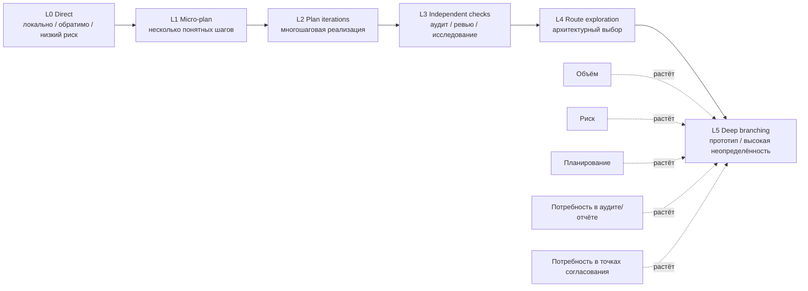

# Уровни маршрутов

Этот документ описывает систему уровней маршрутов, используемую в `codex-ops-workflow-demo`.

Уровни маршрутов помогают выбирать режим выполнения для Codex с учётом объёма задачи, риска, неопределённости, обратимости изменений и потребности в планировании или независимой проверке.

Это не жёсткая оценка сложности задачи. Это маршрутные подсказки: способ выбрать более безопасную форму workflow для конкретной задачи.

---

## 1. Основная идея

Задача для Codex не должна всегда выполняться одинаково.

Небольшая правка опечатки и многофайловый архитектурный рефакторинг требуют разного уровня планирования, валидации и согласования.

Модель уровней маршрутов помогает ответить на вопрос:

```text
Сколько структуры нужно этой задаче до того, как Codex начнёт действовать?
```

---

## 2. Шкала уровней маршрутов



Mermaid source: `diagrams/route-levels.mmd`.

---

## 3. Сводка маршрутов

| Маршрут | Название | Типичное применение |
|---|---|---|
| `L0` | Direct | Маленькое локальное изменение с низким риском. |
| `L1` | Micro-plan | Короткая задача с несколькими очевидными шагами. |
| `L2` | Plan iterations | Многошаговая реализация с контрольными точками. |
| `L3` | Independent checks | Аудит, ревью, исследование или проверка рисков. |
| `L4` | Route exploration | Сравнение возможных архитектурных или реализационных путей. |
| `L5` | Deep branching | Исследование с высокой неопределённостью, прототипы или дорогие проектные ветки. |

---

## 4. L0 Direct

Используется для простых, локальных и обратимых задач.

Примеры:

- исправление опечатки;
- небольшая правка формулировки;
- узкое изменение документации;
- локальное обновление сообщения;
- маленькое исправление бага с очевидным объёмом.

Ожидаемое поведение:

```text
прочитать релевантный файл
сделать маленькое изменение
при необходимости провести валидацию
сообщить, что было изменено
```

Не стоит добавлять избыточное планирование. Главный риск на уровне L0 — лишняя процессная нагрузка.

---

## 5. L1 Micro-plan

Используется для небольших задач, которым нужно несколько шагов, но которые всё ещё остаются локальными и низкорисковыми.

Примеры:

- обновить один небольшой раздел workflow;
- добавить небольшую ветку валидации;
- отредактировать один документационный файл с несколькими согласованными изменениями;
- скорректировать маленькую функцию и соответствующий тест.

Ожидаемое поведение:

```text
кратко описать план
выполнить план
держать diff узким
запустить релевантные проверки
кратко подвести результат
```

L1 полезен, когда задача простая, но всё же выигрывает от явной последовательности действий.

---

## 6. L2 Plan iterations

Используется для многошаговой реализации.

Примеры:

- добавить небольшую новую feature;
- изменить несколько связанных файлов;
- реализовать ветку workflow;
- обновить код + тесты + документацию;
- изменить поведение в ограниченной подсистеме.

Ожидаемое поведение:

```text
разбить работу на итерации
при необходимости останавливаться в значимых контрольных точках
держать scope под контролем
обновлять тесты/документацию там, где это уместно
запускать релевантную валидацию
сообщать об оставшихся рисках
```

L2 — маршрут по умолчанию для обычной нетривиальной реализации.

---

## 7. L3 Independent checks

Используется, когда задача в основном является аудитом, ревью, исследованием или анализом рисков.

Примеры:

- архитектурный аудит;
- аудит тестового покрытия;
- ревью diff;
- проверка согласованности документации;
- оценка рисков удаления/рефакторинга;
- проверка безопасности выбранного пути реализации.

Ожидаемое поведение:

```text
проводить read-only inspection
собирать evidence
выдать findings
не изменять код автоматически
рекомендовать следующий безопасный шаг
```

L3 особенно полезен перед рискованной реализацией.

Важная граница:

```text
Аудит не равен разрешению на реализацию.
```

---

## 8. L4 Route exploration

Используется, когда правильное направление не очевидно.

Примеры:

- выбор между архитектурными подходами;
- оценка необходимости нового слоя;
- сравнение storage/backend/provider-вариантов;
- решение между рефакторингом и точечным patch;
- проектирование нового механизма workflow.

Ожидаемое поведение:

```text
выявить возможные маршруты
сравнить trade-offs
перечислить риски и ограничения
рекомендовать направление
избегать реализации без явного согласования
```

L4 помогает избежать преждевременной реализации.

---

## 9. L5 Deep branching

Используется для высоконеопределённого или дорогого исследования.

Примеры:

- prototype branches;
- крупные архитектурные альтернативы;
- широкая стратегия миграции;
- высокорисковые изменения model/provider/runtime;
- несколько возможных продуктовых направлений.

Ожидаемое поведение:

```text
определить ветки
исследовать trade-offs
держать эксперименты ограниченными
фиксировать assumptions
не переносить прототипное мышление в production decisions без ревью
```

L5 не является маршрутом по умолчанию. Он нужен для случаев, где исследование важнее немедленной реализации.

---

## 10. Выбор маршрута

При выборе маршрута нужно учитывать:

| Вопрос | Если да, маршрут может повыситься |
|---|---|
| Задача затрагивает несколько файлов? | L1 → L2 |
| Архитектурное направление неопределённо? | L3 → L4 |
| Изменение трудно откатить? | L2 → L3/L4 |
| Задача в основном исследовательская? | L3 |
| Задача долгосрочная/протяжённая? | L2 + ExecPlan |
| Изменение влияет на публичное поведение? | L2/L3 |
| Изменение влияет на security/payment/model policy? | L3/L4 |
| Нужна сравнительная проверка прототипов? | L5 |

---

## 11. Отклонение от маршрута

Маршрутные подсказки — это ориентир, а не клетка.

Codex может выбрать более лёгкий или более тяжёлый маршрут, если inspection репозитория показывает, что исходный маршрут небезопасен или избыточен.

Примеры:

```text
Задача просит L0,
но inspection репозитория показывает, что изменение затрагивает workflow transitions.
→ Codex должен повысить маршрут или запросить согласование.

Задача просит L3,
но после inspection проблема оказывается однострочной опечаткой.
→ Codex может объяснить это и использовать более лёгкий маршрут.
```

Значимое отклонение от маршрута должно быть объяснено в результате.

---

## 12. Уровни маршрутов и ExecPlans

Уровни маршрутов и ExecPlans связаны, но не идентичны.

ExecPlan обычно уместен, когда работа:

- существенная;
- многошаговая;
- многофайловая;
- архитектурно чувствительная;
- протяжённая;
- вероятно потребует handoff/recovery.

Типичное соответствие:

| Маршрут | Нужен ExecPlan? |
|---|---|
| L0 | Нет |
| L1 | Обычно нет |
| L2 | Иногда |
| L3 | Нет, кроме случаев, когда аудит приводит к согласованной реализации |
| L4 | Нет для анализа; возможно после выбора маршрута |
| L5 | Часто да, если реализация/прототипирование согласованы |

---

## 13. Уровни маршрутов и отчёты

Отчёты полезны, когда результатом является анализ, а не реализация.

Типичное соответствие:

| Маршрут | Нужен отчёт? |
|---|---|
| L0 | Нет |
| L1 | Обычно нет |
| L2 | Опциональная сводка |
| L3 | Часто да |
| L4 | Часто да |
| L5 | Часто да |

Отчёты сохраняют findings, но по умолчанию не являются source of truth.

---

## 14. Summary

Система уровней маршрутов помогает предотвратить две типовые ошибки:

```text
слишком мало процесса для рискованных задач
слишком много процесса для простых задач
```

Цель — сопоставить риск задачи с правильным режимом выполнения:

```text
маленькая локальная задача → лёгкий маршрут
рискованная неопределённая задача → аудит / отчёт / план / согласование
```

Уровни маршрутов делают работу Codex более ограниченной, объяснимой и пригодной для ревью.
